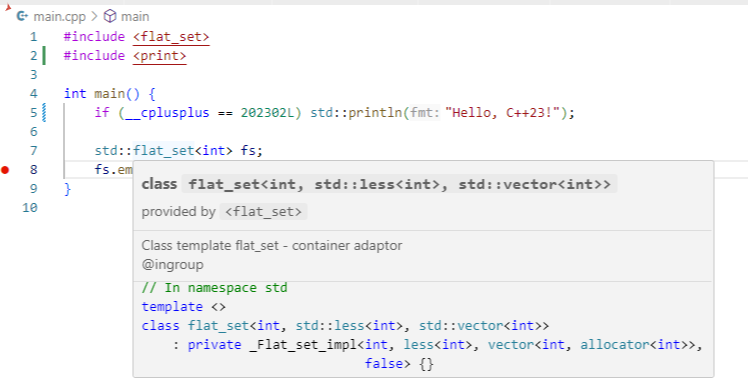
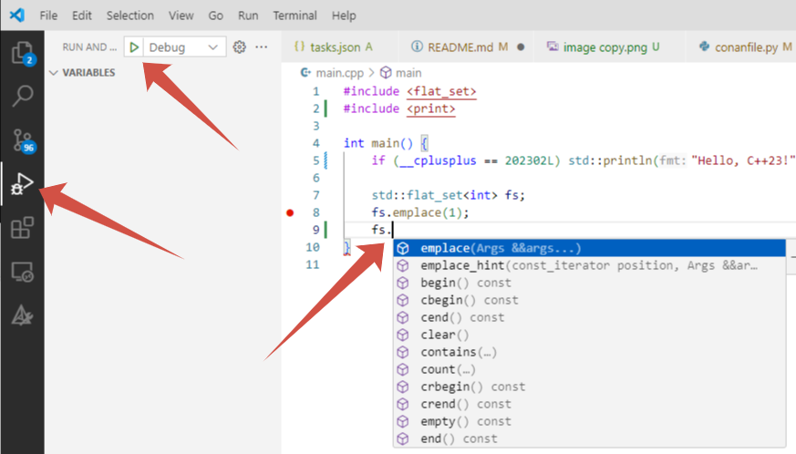

# cpp-middle-docker <!-- omit in toc -->

- [Начало работы](#начало-работы)
- [Сборка проекта и запуск тестов](#сборка-проекта-и-запуск-тестов)
  - [Команды для сборки проекта](#команды-для-сборки-проекта)
  - [Команды для запуска приложения](#команды-для-запуска-приложения)
  - [Команда для запуска тестов](#команда-для-запуска-тестов)
  - [Команда для запуска clang-format - Обязательное требование перед сдачей работы на ревью](#команда-для-запуска-clang-format---обязательное-требование-перед-сдачей-работы-на-ревью)
  - [Команды для запуска отладчика](#команды-для-запуска-отладчика)


Шаблон репозитория с докер контейнером для выполнения заданий курса «Мидл разработчик С++»

## Начало работы

1. Нажмите зелёную кнопку `Use this template`, затем `Create a new repository`.
2. Назовите свой репозиторий.
3. Склонируйте созданный репозиторий командой `git clone your-repository-name`.
4. Создайте новую ветку командой `git switch -c development`.
5. Откройте проект в `Visual Studio Code`.
6. Нажмите `F1` и откройте проект в dev-контейнере командой `Dev Containers: Reopen in Container`.

## Сборка проекта и запуск тестов

Данный репозиторий использует два инструмента:

- **Conan** — свободный менеджер пакетов для C и C++ с открытым исходным кодом (MIT). Позволяет настраивать процесс сборки программ, скачивать и устанавливать сторонние зависимости и необходимые инструменты. Подробнее о Conan:
  - https://habr.com/ru/articles/884464
  - https://docs.conan.io/2.0/tutorial/consuming_packages/build_simple_cmake_project.html
  - https://docs.conan.io/2.0/tutorial/consuming_packages/the_flexibility_of_conanfile_py.html
- **cmake** — генератор систем сборки для C и C++. Позволяет создавать проекты, которые могут компилироваться на различных платформах и с различными компиляторами. Подробнее о cmake:
  - https://dzen.ru/a/ZzZGUm-4o0u-IQlb
  - https://neerc.ifmo.ru/wiki/index.php?title=CMake_Tutorial
  - https://cmake.org/cmake/help/book/mastering-cmake/cmake/Help/guide/tutorial/index.html

### Команды для сборки проекта

Используйте `F5` для выполнения следующих шагов:
- Создание папки `build`
- Вызов `conan` команд для установки требуемых библиотек и запуска процесса сборки
- Запуска `lldb` отладчика

### Команды для запуска приложения

```bash
cd build
./app 
```

### Команда для запуска clang-format - Обязательное требование перед сдачей работы на ревью

```bash
./run_clang_format.sh
```

### Дополнительно

- Автодополнение `Ctrl + Space`. Для настройки автодополнения вам необходимо нажать `F1` и выполнить команду `clangd: Download language server`. VS Code сам предложит установить подходящую версию `clangd` (всплывашка в правом нижнем углу). После завершения установки потребуется перезагрузить окно (кнопка перезапуска будет находиться также справа снизу или нажать `F1` и выполнить команду `Developer: Reload Window`)

Если всё сделано правильно - после успешной сборки проекта вы сможете использовать автодополнение:




